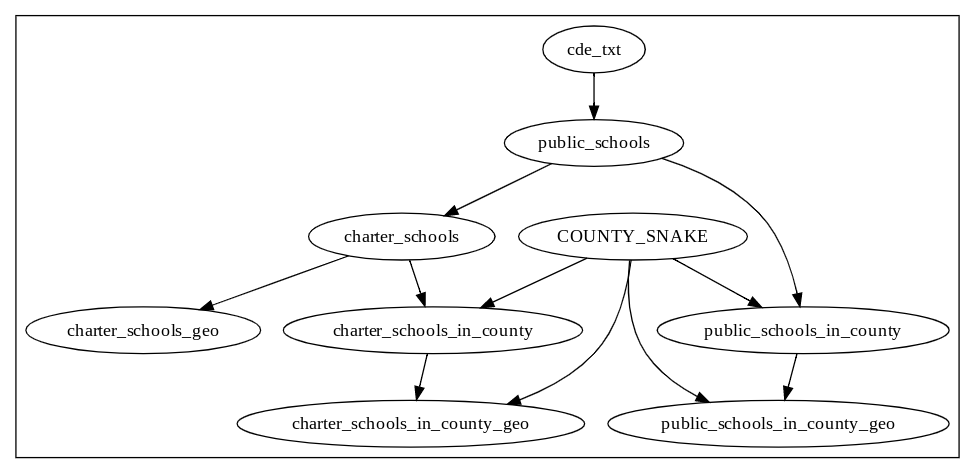

# oak

A framework for reproducible, reusable data workflows.


**Note** - `oak` is still under development - Watch this repo or [follow me on twitter](https://twitter.com/agarcia_me) to keep updated!


## What is `oak`?

`oak` is a CLI tool for small, static, data analysis projects.

`oak` works well with projects that have a chain (or tree) of scripts that process files. For example, you may have a series of python/R/shell scripts that take in files as an input, processes them in some way, then outputs new files. This is an ETL (Extract, Transform, Load) workflow - and `oak` makes it easier to define, develop, and re-use these workflows.

## Benefits of `oak`

### Reproducibility

With many data projects, it can be unclear on how to start - which script do you run first? What argument do I pass in, if any? what if I want to change a filename?

`oak` makes this all easy - just run `oak static` to execute an `Oakfile` that run the entire project - in-order, everytime. `oak` could be ran in a service like CircleCI to prove that your analysis is technically sound and reproducible (examples coming soon).

### Language Agnostic

While `oak` is written in TypeScript, you can use the tool to kickoff any process in any language - for example, this is a sample `Oakfile` that uses python, R, and nodeJS:

```javascript
scraped_data = task({
  target: "scraped_data.csv",
  run: scraped_data => shell`python scrape.py > ${scraped_data}`
});

analyzed_data = task({
  target: "analysis.csv",
  run: analyzed_data =>
    shell`Rscript analysis.R --input=${scraped_data} > ${analyzed_data}`
});

graphic = recipe({
  target: "graphic.jpg",
  graphic => 
    shell`node generate-graphic.js --input=${analyzed_data} > ${graphic}`
});
```

In this `Oakfile`, the script `scrape.py` scrapes some website, and then formats it as CSV and is outputed into `scraped_data.csv`. Then, `analysis.R` is ran, using `scraped_data.csv` as input, and outputs into `analysis.csv`. Finally, `generate-graphic.js` is called, taking `analysis.csv` as input and outputs into `graphic.jpg`.

In order to do all the above, all you would have to run is `oak run`. All the scripts will be run in the correct order with the correct parameters, and you will have a `scraped_data.csv`, `analysis.csv`, and `graphic.jpg` generated inside of the `oak_data/` directory! 

You're able to call any language, tool, or program that's accessible through the command line - which is basically everything!

### Better Documentation

With one command, `oak print --output=png`, you can create a graphic that explains your entire data workflow:



This workflow downloads a dataset from the California government containing data about all K-12 schools in the state (`cde_text`), then filters out for public schools, charter schools, public/charter schools in Los Angeles country, and then generates `.geojson` files for all those combinations.

_Note_ - this feature is still being worked on, and this specific example is kindof a mess...

## Examples of when to use `oak`

- You have a series of python scripts that convert raw PDFs into CSVs, which you then generate graphs for
- You do some light scraping of a website, generate a dataset, then clean that dataset with R
- You have a giant sqlite database, and a series of shell/python/perl/ scripts that eventually generate a small, cleaned CSV file.
- You have code from 4 years ago that parsed election results and generated maps, and you want to re-use that workflow in the next election (with little headache)

## When to NOT use `oak`

- In a high performance, production setting - `oak` is meant to be called by developers manually, not be some production server many times per minute
- For scheduling or monitoring workflows - see [Airflow](https://airflow.apache.org/index.html)

## Why not `make`?

`make` is another CLI tool that comes pre-installed in many linux/mac environments and works similar to `oak` - you write a `Makefile` that creates a DAG of file dependencies, which, when ran, only builds targets that are out of date.

`oak` is meant to be an easier to use, more extensible version of `make`. `make` can be very frustrating to use, for data analysis. For example:

- Doesn't work for windows, without hacky ports
- "Correct" syntax depends on which `make` tool you use
- The teensiest syntax error gives you the most cryptic error messages possible
- Something as simple as making a variable is a confusing process
- Documentation is decades old
- Examples online are primarly meant for compiling code
- Importing a `Makefile` from another `Makefile` to borrow code is impossible (or very complicated)

`oak` tries to avoid these problems. `make` is great if you're a linux low-level programmer trying to compile a codebase of millions of files, but if you just want to better define your data workflow, it can be overkill.

#### Why not Airflow/Mara/Bonobo/some other ETL framework?

TODO add more context/links

## Installing

```
npm install -g @alex.garcia/oak
```

## Usage

- `oak init` - create `Oakfile` in current directory
- `oak run` - run the `Oakfile`, run recipes that are out of date
- `oak print` - Print out dependencies of recipes in `Oakfile`. Can also use `--output dot` for printing graphviz dot notation

## `oak` Behind the scenes

`oak` is built on the ObservableHQ [runtime](https://github.com/observablehq/runtime) and [parser](https://github.com/observablehq/runtime). `oak` runs a given `Oakfile`, which is written by users in javascript, with similar syntax to Observable notebooks.
