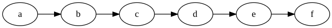
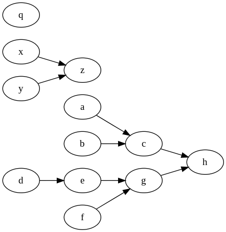

# Introduction

## Terminology

When you use `oak`, you create a file called `Oakfile`. You can name it however you wish - `Oakfile.js` if you want javascript syntax highlighting, most oak commands have a `-f` or `--file` flag (e.g. `oak print -f Oakfile.js`, `oak static --file path/to/Oak`, etc.).

Each Oakfile has code that defines a **workflow**. Each workflow is a series of re-usable components called **recipes**. Each recipe outputs a file - and a recipe can take in other recipe's outputted files as input.

For example, this is an example workflow that has a series of recipes that work together linearly:

In this workflow, there is a recipe `a` that outputs some file - let's say `a.txt`. Then, recipe `b` takes in that file, `a.txt`, as input, and outputs a file, `b.txt`. Then, recipe `c`, takes in `b.txt` as input, outputs, a file, and so on and so forth, until recipe `f` outputs a file, `f.txt`.

Workflows don't have to run linearly like above - as long as it's a [directed acyclic graph](https://en.wikipedia.org/wiki/Directed_acyclic_graph) (ie, no loops), then `oak` will run it.

Here's a more complex example:

Notice how there's 3 distinct "outputs" to this workflow - `q`, `z`, and `h`. This is completely legal - not all recipes have to work together like the example above.

### Comparing to Observable notebooks

`oak` is built on the same runtime and parser as [Observable notebooks](https://observablehq.com) - so many concepts are similar.

An entire Observable notebook is similar to a single `Oakfile` - in fact, an Observable notebook is a [module in the Observable runtime](https://github.com/observablehq/runtime#modules), and an Oakfile also is just a module.

A cell in an Observable notebook is similar to a recipe in an `Oakfile`. You could define cells in an `Oakfile` that aren't recipes, but in most use cases, every cell in an Oakfile is a recipe.

There are two main differences between an Observable notebook and an `Oakfile`. The first one is that Observable notebooks are executed in your browser, and `Oakfiles` are executed on your computer's shell. There are security implications of this, so I'd highly recommend reading the [Security portion](./security) of these docs - ESPECIALLY if you're running someone else's code.

The second different is that Observable notebook uses [a standard library](https://github.com/observablehq/stdlib) that's built for web browsers, while `oak` uses a smaller standard library that's built for node.js. See the [API Reference](./reference) to learn more about `oak`'s standard library.

### Explaining with a cooking metaphor
